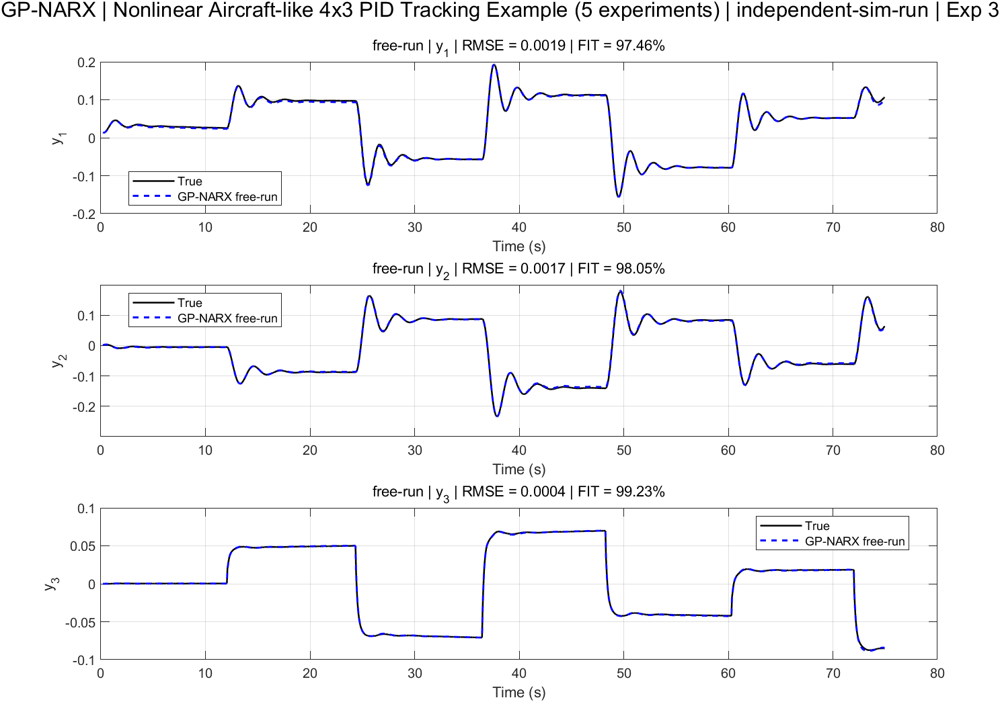

# GP-NARX with Multi-Experiment Training and Simulation-Run Validation

This repository implements a Gaussian Process NARX (GP-NARX) model trained on multiple experiments and evaluated not only on standard validation sets but also on independent simulation runs.

---

## 🔹 Motivation

In many practical scenarios, the internal dynamics of a system are **unknown or difficult to model explicitly**.  
This makes it challenging to design control laws based on first-principles models.

This project aims to address this limitation by constructing a **data-driven dynamical model** that can be used for control design.

> **Goal:** Enable control-oriented modeling when the internal system structure is unknown.

In particular, the focus is on building models that are not only accurate in prediction, but also:

- Suitable for **controller design**
- Capable of reproducing **closed-loop system behavior**
- Reliable in **long-horizon (free-run) simulation**

---

### Why standard evaluation is insufficient

Conventional system identification typically evaluates models using **one-step-ahead prediction**.

However, this is often insufficient because:
- The model always uses **true past outputs**
- It does not reveal **error accumulation**
- It does not reflect **closed-loop behavior**

---

### Key question addressed in this work

> **Can a data-driven model be used to design control gains without knowing the internal system, while still accurately reproducing system dynamics in free-run simulation?**

---

## 🔹 Method Overview

The pipeline consists of the following steps:

1. **Multi-experiment training**
   - Data from multiple independent experiments are aggregated
   - Optional block-coverage sampling is used to improve training diversity

2. **GP-NARX modeling**
   - Nonlinear mapping:
     ```
     y(k) = f(y(k-1), ..., u(k-1), ...)
     ```
   - One GP model per output channel

### 3. Evaluation Modes

Two complementary evaluation strategies are used:

#### ▸ One-step-ahead prediction
- Uses true past outputs
- Measures regression accuracy

#### ▸ Free-run simulation (rollout)
- Uses predicted outputs recursively
- Evaluates **dynamic consistency and stability**

Additionally:

#### ▸ Independent simulation-run validation
- Model is tested on **completely new experiments**
- No overlap with training data
- Reflects true generalization capability

---

## 🔹 Example: Nonlinear Aircraft PID Tracking

A representative benchmark dataset is included:

- Nonlinear **6-state aircraft-like system**
- Closed-loop control via PID

### System characteristics
- **Inputs (4)**: control surfaces + throttle  
- **Outputs (3)**: pitch, roll, yaw rate  
- Includes:
  - actuator saturation  
  - nonlinear coupling  
  - process and measurement noise  

---

### Behavior overview

#### ▸ Reference tracking
- Piecewise-constant commands
- Moderate nonlinear coupling across channels

#### ▸ Control inputs
- Actuator saturation visible
- Cross-coupling between channels

---

### Why this dataset?

This example provides a realistic and challenging identification scenario:

- Strong **nonlinearity**
- **MIMO (multi-input multi-output)** coupling
- Closed-loop dynamics with control interaction
- Suitable for testing **free-run prediction robustness**

---

## 🔹 Results

<p align="center">
  
</p>

<p align="center">
  <em>Example: Free-run simulation vs ground truth (nonlinear aircraft system)</em>
</p>

---

## 🚧 Status

### GP-NARX
- Stable and fully functional  
- Supports multi-experiment training and rollout evaluation  

### VGP-SSM (Variational Gaussian Process State-Space Model)
- Under active development  
- Core components partially implemented  
- Not yet fully validated or benchmarked  

> ⚠️ **Warning:** VGP-SSM results may be unstable and are not finalized.

---

## 🔹 Future Work

- Complete VGP-SSM implementation
- Compare GP-NARX vs GP-SSM on:
  - long-horizon rollout stability
  - data efficiency
- Extend to:
  - real experimental datasets
  - online / adaptive identification

---

## 🔹 Notes

- Built on **GPML toolbox**
- Designed for:
  - nonlinear system identification
  - simulation-based validation
  - research prototyping

---